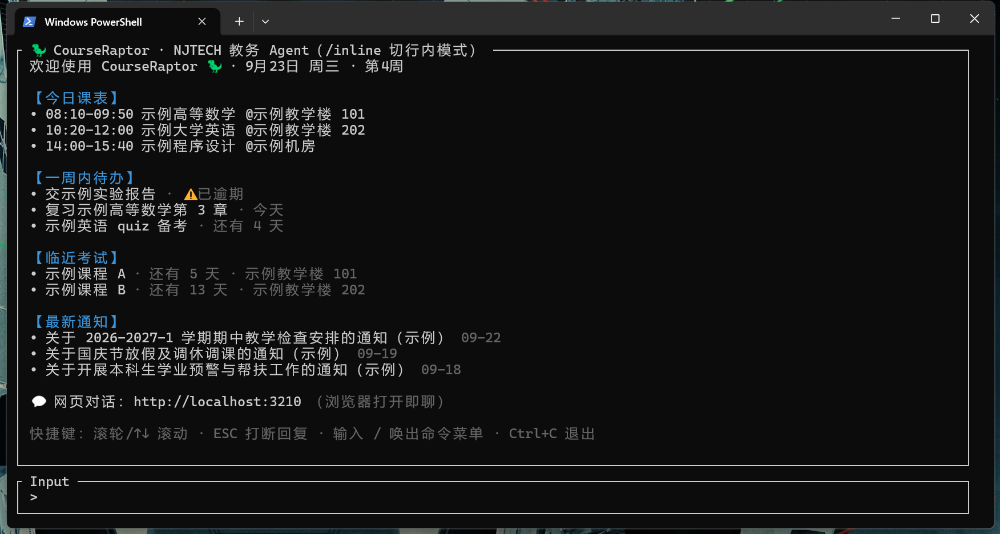
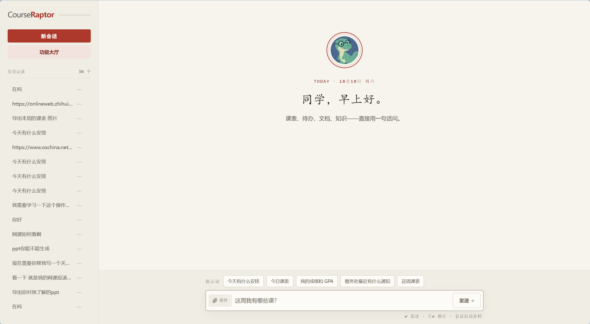

<div align="center">


# CourseRaptor

### Less time navigating academic portals. More time for student life.

**An open-source conversational academic agent — fully adapted for Nanjing Tech University (NJTECH), community-adapted for Hebei Agricultural University (HEBAU), usable at any other school via manual timetable import.**

**Also a production-grade local-first Agent engineering reference**: Vercel AI SDK v7 · ports-and-adapters `SchoolAdapter` architecture · three entrances, one kernel · everything auditable.

[简体中文](README.md) · **English**

[](https://github.com/Health-525/courseraptor/actions/workflows/ci.yml)
[](LICENSE)
[](https://nodejs.org/en/download)
[](https://x.com/github_daily/status/2105560876132757969)
[](https://github.com/1c7/chinese-independent-developer/blob/master/.github/pages/README-Programmer-Edition.md)

[Try the demo](#try-it-without-credentials) · [Quick start](#use-your-own-academic-account) · [Discuss](https://github.com/Health-525/courseraptor/discussions) · [Contribute](CONTRIBUTING.md)

</div>

CourseRaptor brings timetables, grades, exams, academic announcements, and calendar exports into one conversational interface. Ask in the terminal, the browser, or QQ — three entrances sharing one agent kernel and one memory store. Everything runs on your own machine: credentials are AES-256-GCM encrypted on disk, and it talks to your own model API key — DeepSeek by default, with 11 more built-in Chinese providers (Qwen, Zhipu GLM, Kimi, Doubao, Hunyuan, MiniMax, Step, ERNIE, Spark, SiliconFlow, China Mobile Cloud) plus custom OpenAI-compatible endpoints. The Windows installer includes anonymous install telemetry (a random device ID, version, and platform once every 24h; disable with `RAPTOR_NO_TELEMETRY=1`); running from source never reports.

If you are building agents yourself, the repo doubles as a reference implementation: how a `ToolLoopAgent` loop organizes 36 tools, how external systems sit behind a ports-and-adapters boundary (a new school is one self-contained directory, zero kernel changes), and how a multi-provider model layer is assembled from a plain-data registry. See [Build with us](#build-with-us) below.

> ⚠️ **The online academic-system integration supports Nanjing Tech University (full) and Hebei Agricultural University (community adapter, PR #204).** Any other school can start immediately with manual timetable import. This is an independent, unofficial project. The product interface and most documentation are in Chinese; this English overview helps developers understand and contribute to the project. The [Chinese README](README.md) is the authoritative, fully detailed version.

## What it does

| Student question | Available capability |
|---|---|
| Where are my classes this week? | Timetables by semester and teaching week, including odd/even weeks and recorded schedule adjustments |
| How am I doing academically? | GPA, earned credits, failed courses, and grades requiring confirmation |
| Which general elective categories have I covered? | Passed-course category summaries to help check your own curriculum requirements |
| When are my exams? | Exam subjects, dates, times, rooms, and seat information |
| What does this announcement require me to do? | Announcement lists with per-grade relevance, full text, and cached attachments (spreadsheet filtering, paginated document reading) |
| Can I use my phone calendar? | Local `.ics` export; optional publication to a public GitHub/Gitee subscription source |
| Can I turn this material into a document? | Local document/table reading and Word, Excel, PowerPoint, and PDF generation with cross-format conversion |
| My school is not NJTECH | Manual timetable mode: paste timetable text or upload Excel/CSV/PDF/Word/TXT, and the AI parses it into a structured timetable |

The agent ships **36 tools** (Nanjing Tech's default set, auto-trimmed per school). See [capabilities](docs/capabilities.md) for the full table. A headless CLI ([`skills/njtech-jwgl/`](skills/njtech-jwgl/SKILL.md)) exposes the same academic queries for scripting without touching the LLM.

Both screenshots below use fictional demo data.

**Terminal TUI** — type `raptor` to chat; the first screen shows today's classes, todos, upcoming exams, and latest notices:

<p align="center"></p>

**Web chat** — open `http://localhost:3210` in a browser; reasoning and tool calls are visible in the conversation:

<p align="center"></p>

## Try it without credentials

Install Node.js 24 or later, then:

```bash
git clone https://github.com/Health-525/courseraptor.git
cd courseraptor
npm ci
npm run doctor
npm run demo
```

Open the URL printed in the terminal, normally `http://127.0.0.1:3211`.

The demo uses **fictional data and scripted responses**. It does not read personal credentials, contact the university or an AI provider, or persist conversations to disk. It demonstrates the interface, not live AI performance. Press `Ctrl+C` to stop.

To showcase real AI analysis with the same fictional data, run `npm run demo:live` instead. It answers with a real DeepSeek model (requires a `DEEPSEEK_API_KEY` in the environment or the project `.env`; API usage may incur charges) while every tool still returns fictional samples, so no account or personal data is involved. Without a key it falls back to the scripted offline demo.

## Use your own academic account

Windows users can grab a self-contained installer (bundled Node runtime, ~116 MB) from [Releases](https://github.com/Health-525/courseraptor/releases/latest) — no development environment needed. From source, run `npm start` (or double-click `start.bat` on Windows). Follow the prompts to configure your university credentials and model API key (DeepSeek by default; other providers can be switched in the web Settings panel). You can also skip the campus account with an empty Enter and fill it in later via the web Settings panel. Provider API usage may incur charges.

The browser UI usually runs at `http://localhost:3210`; follow the actual startup address if that port is busy. Keep the terminal running. To change your API key securely, enter `/key` without arguments in the terminal.

## Architecture overview

- **Agent runtime**: Vercel AI SDK v7 (`ToolLoopAgent` + `runAgentTUI` for terminal)
- **LLM**: DeepSeek by default (`deepseek-flash` / V4.1-Flash), switchable to 11 more Chinese providers or a custom OpenAI-compatible endpoint — each provider's key stored and hot-swapped independently
- **Academic protocol**: Custom NJTECH 正方新版 adapter (RSA + CSRF login; course selection reverse-engineered from official frontend)
- **Web UI**: Single-page Node server (`src/channels/web/`) with push-panel layout, session history, and real-time tool result sync
- **Ports and adapters**: `src/core/school.ts` defines the `SchoolAdapter` port; core never imports adapters, so adding a school means adding one self-contained directory under `src/adapters/`
- **Data storage**: Local JSON files only (`data/`, `session.json`, `memory.json`, `credentials.enc`); no database, no cloud sync

## Project structure (key directories)

```
├── bin/raptor.cjs        # Global CLI entry (npm link)
├── docs/                 # Assets & extended docs
├── skills/njtech-jwgl/   # Headless academic-query skill (no LLM, no tokens)
├── src/
│   ├── core/             # School-agnostic kernel: agent, memory, calendar,
│   │                     # documents, attachments, knowledge + generic tools
│   ├── adapters/
│   │   ├── njtech/       # NJTECH implementation: login, schedule, grades,
│   │   │                 # exams, course selection, notices + school tools
│   │   ├── hebau/        # HEBAU implementation: CAS SSO + Zhengfang URP
│   │   └── custom/       # Other schools (manual timetable mode)
│   └── channels/web/     # Web UI: chat, hall, /today, /todos, /knowledge
└── local/                # Entrypoints: cli (TUI), qq (bot bridge), demo
```

## Boundaries that matter

- Local hosting does **not** mean fully offline processing: prompts and relevant query results are sent to the configured model provider.
- Category coverage is not a graduation audit. Check requirements for your own program and enrollment year.
- Local calendar export does not require publication. The current subscription implementation publishes to a **public repository**, so confirm the disclosure of course locations and times.
- QQ users share the configured university identity; the allowlist is not multi-student account isolation.
- Real course-enrollment submission is disabled by default. Follow university rules and confirm actions before enabling it.
- Curriculum audits are **not yet implemented**. (Reminders, schedule-change detection, and a second university integration — HEBAU — have all shipped.)

Share the repository URL or an inspected clean installation package, never your used project directory. See [privacy and security](SECURITY.md).

## Supported schools

| University | Capabilities | Adapter maintainer |
|---|---|---|
| [Nanjing Tech University](src/adapters/njtech/) (NJTECH) | All online capabilities | [@Health-525](https://github.com/Health-525) |
| [Hebei Agricultural University](src/adapters/hebau/) (HEBAU) | Timetable / grades / exams (CAS SSO + Zhengfang URP; dynamic-code second factor) | [@gzxb001-sketch](https://github.com/gzxb001-sketch) |

Other schools work through the manual timetable mode (paste or upload a timetable and let the AI parse it). Your school not listed? [Request an adapter](https://github.com/Health-525/courseraptor/issues/new?template=request-school.yml) with a few details, or [write one yourself](docs/adapter-guide.md) — adapters are self-contained, Zhengfang-based systems have a full reference implementation to copy from, and merged PRs carry your name as that school's maintainer.

## Build with us

Beyond the student tool, the repo is a working reference for local-first agents — every pattern below ships in daily use, backed by tests, free to lift under the MIT license with additional restrictions (academic submissions and competition entries are not permitted — see [LICENSE](LICENSE)):

- **Agent loop**: Vercel AI SDK v7 `ToolLoopAgent` + `runAgentTUI` driving 36 tools across multi-turn loops — [`src/core/agent.ts`](src/core/agent.ts)
- **Ports & adapters**: the `SchoolAdapter` port (`src/core/school.ts`) keeps the kernel free of any school import; Zhengfang-new and CAS+URP differences never leak past an adapter — [`src/adapters/`](src/adapters/)
- **Multi-provider model layer**: a plain-data provider registry plus one model factory; 12 Chinese providers + custom OpenAI-compatible endpoints, keys encrypted independently and hot-swapped — [`src/core/providers.ts`](src/core/providers.ts)
- **Two-tier memory**: cross-restart session continuity plus self-maintained long-term facts, local JSON only — [`src/core/memory/`](src/core/memory/)
- **Local-first security**: AES-256-GCM credentials bound to the machine fingerprint, loopback-only web with Origin/CSRF checks, network-less sandboxed JS — [`src/core/credentials.ts`](src/core/credentials.ts)
- **Engineering floor**: TypeScript `strict`, node:test with a coverage floor, Biome, dual-OS CI — [`tsconfig.json`](tsconfig.json) · [`.github/workflows/ci.yml`](.github/workflows/ci.yml)

**The adapter flywheel has already turned once**: the Hebei Agricultural University adapter was written and merged by an outside contributor ([PR #204](https://github.com/Health-525/courseraptor/pull/204)), who is now that school's credited maintainer. Your school missing? Follow the [adapter guide](docs/adapter-guide.md) (Chinese) — Zhengfang-based systems have a full reference implementation to copy from.

```bash
npm run typecheck
npm run lint
npm test
```

[Contributing](CONTRIBUTING.md) · [Adapter guide](docs/adapter-guide.md) · [Roadmap](docs/roadmap.md) · [Capabilities](docs/capabilities.md) · [Student guide](docs/student-guide.md)

Found it useful? A star, a reproducible issue, or a concrete student use case helps the project improve. Built something of your own on these patterns? Share it in [Discussions](https://github.com/Health-525/courseraptor/discussions).

Released under the [MIT License](LICENSE) with additional restrictions: using this software for academic submissions (theses, coursework) or competition entries is not permitted (see [LICENSE](LICENSE)). No official affiliation with or endorsement by Nanjing Tech University.
