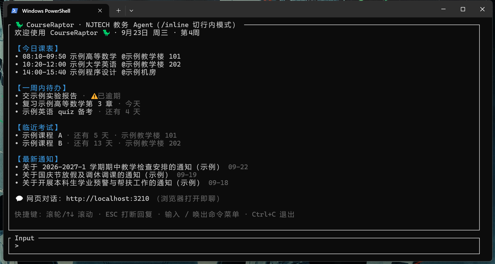
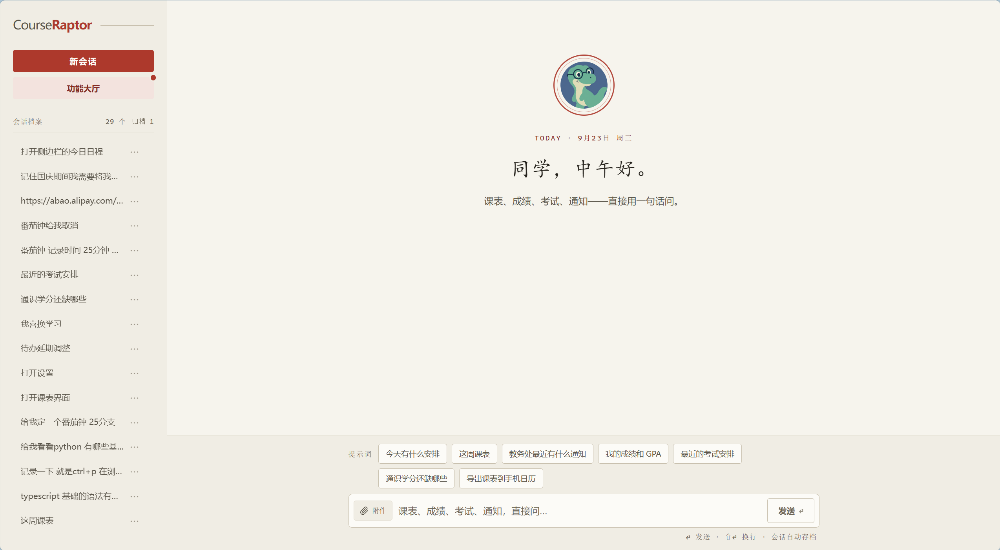

<div align="center">


# 🦖 CourseRaptor

**大学教务对话式 Agent**  
课表 · 成绩 · 考试 · 学籍 · 教务通知 · 待办 · 知识库 · 记忆，一句话搞定。

[](https://github.com/Health-525/courseraptor/releases/latest)
[](#)
[](https://ai-sdk.dev)
[](https://www.deepseek.com)

[](#-技术栈)
[](https://github.com/Health-525/courseraptor/commits/master)
[](https://github.com/Health-525/courseraptor)

**[🚀 快速开始](#-快速开始) · [✨ 核心能力](#-核心能力) · [📡 已知状态](#-已知状态-2026-09) · [🏗️ 技术栈](#-技术栈) · [⚠️ 免责声明](#️-免责声明与使用建议) · [📖 完整文档](docs/capabilities.md)**

</div>

---

## 🖥️ 界面预览

> 截图均为虚构示例数据(演示模式),不代表真实教务信息。

**终端卡片 TUI** —— 敲 `raptor` 直接开聊,启动首屏即见今日课表、一周待办、临近考试与最新通知:

<p align="center"></p>

**网页对话** —— 浏览器打开 `http://localhost:3210` 即聊,思考过程与工具调用全程可见:

<p align="center"></p>

---

## 🎯 适用人群

- **南京工业大学在校学生**：想用对话方式查课表、看成绩、订考试日历、记待办、沉淀知识点
- **想体验本地化 AI Agent 的开发者**：Vercel AI SDK + DeepSeek + 自研教务协议的完整工程样例
- **关注隐私的用户**：**全本地运行，数据不出设备**，凭证 AES-256-GCM 加密落盘，无任何遥测上报

---

## 🔒 隐私承诺

| 承诺 | 实现方式 |
|------|----------|
| 数据不出设备 | 所有教务查询、文件解析、文档生成、记忆存储均在本机完成 |
| 凭证加密存储 | 教务密码、API Key、QQ 机器人密钥均经 AES-256-GCM 加密写入 `credentials.enc` |
| 无遥测/上报 | 代码中无任何统计埋点、错误上报、使用情况收集逻辑 |
| 可审计 | 完全开源，`src/` 下所有网络请求、文件读写、加密逻辑均可直接阅读 |

---

## 💻 系统要求

| 项目 | 要求 |
|------|------|
| **操作系统** | Windows 10/11、macOS 12+、Linux (glibc 2.28+) |
| **Node.js** | ≥ 24（安装包已内置 Node 运行时，**无需预装**） |
| **内存** | ≥ 512 MB 可用（运行时约 150-300 MB） |
| **磁盘** | ≥ 300 MB（含运行时、依赖、本地数据） |
| **网络** | 首次配置需联网拉取 DeepSeek API、教务系统；之后可离线使用已缓存数据 |

---

## 🚀 快速开始

同一个 agent，两种入口：终端里敲 `raptor` 直接对话，或浏览器打开 `http://localhost:3210` 用网页版。思考过程、工具调用、每轮问答都会归档进会话历史。

### 方式一：下载安装包（推荐给同学，无需任何开发环境）

1. 到 [Releases](https://github.com/Health-525/courseraptor/releases/latest) 下载文件名带 **`portable-win-x64`** 的 zip（约 112 MB，**已内置 Node 运行时，不用装 Node.js、也不用联网装依赖**）。别下页面最底部 GitHub 自动生成的 Source code 包。
2. 右键 zip →「全部解压缩」，双击解压出来文件夹里的 **`start.bat`**（首次会引导录入教务账号和 DeepSeek API Key，加密存在本机，之后免填；教务账号也可直接回车跳过，之后在网页「功能大厅 → 设置 → 教务账号」里补填）。

> 双击没反应或被拦截：包里的 `runtime\node.exe` 是 Node 官方运行时、未做代码签名，SmartScreen 弹窗选「更多信息 → 仍要运行」，或把解压出的 `CourseRaptor` 文件夹加入杀软信任区。

### 方式二：git 克隆（开发者）

```bash
# 1. 克隆 & 安装
git clone https://github.com/Health-525/courseraptor.git
cd courseraptor && npm install

# 2. 配置凭证
#    DeepSeek Key：cp .env.example .env 后编辑填入
#    教务账号：留空即可，首次启动 raptor 引导录入并加密保存本机；引导时回车可跳过，跳过后在网页「功能大厅 → 设置 → 教务账号」里补填

# 3. 注册全局命令（一次即可，任意目录可用）
npm link

# 4. 启动
raptor                 # 全局命令
npm run dev            # 或项目内开发模式
```

### 🔄 自动更新（给同学）

raptor **每 24 小时检查一次新版本**。有新版时标题栏会出现 `🔄 新版 vX.Y.Z，/update 可更新` 徽标，对话里直接输入：

```text
/update
```

即一键完成：下载新版 → 覆盖安装（你的凭证 / 记忆 / 会话 / QQ 授权名单不受影响）→ 自动装依赖，然后重启 raptor 即可。

不想要提醒：`.env` 里加 `RAPTOR_NO_UPDATE_CHECK=1`。

---

## ✨ 核心能力

Agent 默认可调用 **31 个工具**，覆盖十大能力线。完整参数表、耗时、环境变量、教务模块覆盖清单见 [📖 完整能力文档](docs/capabilities.md)。

| 📚 教务查询 | 📰 通知情报 | 📁 文件与数据 | ✍️ 文档写作 | 🕐 时间·日历·天气 |
|-------------|-------------|---------------|-------------|-------------------|
| 课表/成绩/考试/学籍/已选/重修/实验成绩/选课状态/搜课/搜教学班/**选课冲突对比** | 通知列表(按年级标相关度) / 正文全文 / 附件下载缓存+表格筛选+文档分页读 | 本地文件读取 / Excel 筛选查询 / 沙箱 JS 计算 / 附件缓存管理 | Word/Excel/PPT/PDF 生成 / 跨格式转换 | 日期教学周 / 放假调休落盘 / .ics 导出与订阅 / 天气穿衣建议 |

| 🧠 两层记忆 | 📝 待办提醒 | 📚 知识库 | 🍅 番茄钟 | 💬 QQ 接入 |
|-------------|-------------|-----------|-----------|------------|
| 短期会话跨重启延续 / 长期事实自主维护(合并/过期/归档) | 随口记、到期自动提醒(桌面+QQ)、三端同步 | 对话自动沉淀、按课程归类、多入口检索 | 对话开计时、网页实时倒计时 | 官方机器人零封号、白名单制、对话双向归档 |

---

## 📡 已知状态（2026-09）

- 学期交界期课表/考试查询为**候选学期探测**，不依赖日历日期推断；开学日期按校历维护（未知学期按 9 月/3 月第一个周一估算并标注）。
- 课表查询自动叠加**放假/调休覆盖**：假期日整周标注「放假」、调休补课日按被换周几的课表补出行；具体安排由 agent 读教务处通知后经 `set_holidays` 落盘到 `data/term-holidays.json`。
- 教务线路偶发抖动：所有登录内置 5 次指数退避重试，单学期成绩查询带重试。
- **教务模块覆盖**：已接入 31 个工具；学校侧停用 6 个模块（空闲教室、班级课表等）；申请/流程类 30+ 项暂未接入。详见 [完整文档](docs/capabilities.md#-教务系统模块覆盖清单55-个菜单模块)。

---

## 🏗️ 技术栈

- **Agent**：[Vercel AI SDK v7](https://ai-sdk.dev)（`ToolLoopAgent` + `runAgentTUI`）
- **LLM**：DeepSeek（默认 `deepseek-flash`，即 V4.1-Flash）
- **教务协议**：NJTECH 正方新版适配层（RSA + CSRF 登录；选课接口逆向自官方前端）

**项目结构概览**（完整树见 [完整文档](docs/capabilities.md#-项目结构完整树)）：

```
├── bin/raptor.cjs      # 全局命令入口
├── docs/               # 文档与素材
└── src/
    ├── index.ts        # 终端入口
    ├── agent.ts        # Agent 定义
    ├── config.ts       # 配置加载
    ├── jwgl/           # 教务协议层
    ├── web/            # 网页版 (聊天/大厅/日程/知识库)
    ├── tools/          # 30 个 Agent 工具
    └── ...             # 记忆/待办/知识库/番茄钟/QQ/天气等引擎
```

---

## ⚠️ 免责声明与使用建议

- 本项目可在 [ISC 许可证](LICENSE) 条款下自由使用、复制、修改和分发；本项目与南京工业大学官方无关，也未获其授权或认可。
- 使用者需**自行承担全部风险**：请遵守学校相关规定及教务系统使用条款，因使用本工具产生的任何后果（包括但不限于账号受限、成绩处理）由使用者本人负责。
- 请避免大规模或高频请求，尊重教务系统的承载能力（传输层内置全局限速令牌桶，`RAPTOR_MAX_RPS` 只允许下调、请勿调高）。
- **关于验证码识别**：附件下载路径中的图形验证码由本地 tesseract 自动识别，这在技术上属于绕过网站的反自动化措施。此能力仅限用于获取**本人有权访问的通知附件**，重试上限 3 次；如需完全停用，设 `RAPTOR_DISABLE_CAPTCHA_OCR=1`。

---

## 🔐 安全提示

- `.env` 含教务密码与 API Key，**切勿提交或分享**（建议个人设备使用；更高安全性可留空密码、运行时交互输入）。
- 网页服务仅监听 127.0.0.1，多层防线：Host/Origin 校验、写请求须携带 CSRF token、仅认 application/json。
- 本地敏感文件**请勿分享**：`session.json`（完整对话含学号/成绩）、`memory.json`、`qq-allowlist.json`、`data/chat-sessions.json`（网页+QQ 双渠道对话）。
- 学籍敏感字段（证件号/银行卡/考生号）返回时自动打码。
- 附件云解析仅用于公开网站；教务数据一律本地直连，不经第三方。

---

## 🗑️ 卸载与清理

```bash
# 1. 取消全局命令
npm unlink

# 2. 删除项目目录
rm -rf courseraptor

# 3. 清理本地数据（可选，含凭证/记忆/会话/待办/知识库/日历/附件缓存）
rm -rf data/
rm -f credentials.enc session.json memory.json qq-allowlist.json
```

> ⚠️ 执行第 3 步前请确认已备份重要数据。

---

## ❓ 常见问题

详见 [GitHub Discussions](https://github.com/Health-525/courseraptor/discussions) 或 `docs/faq.md`（待建立）。

---

<div align="center">

**🦖 CourseRaptor** · 让迅猛龙替你守教务

[⬆ 回到顶部](#-courseraptor) · [English Version](README.en.md)

</div>