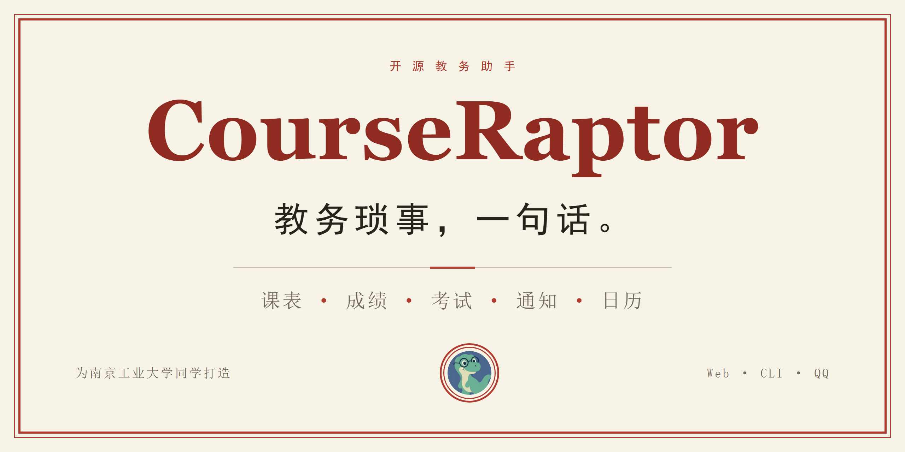
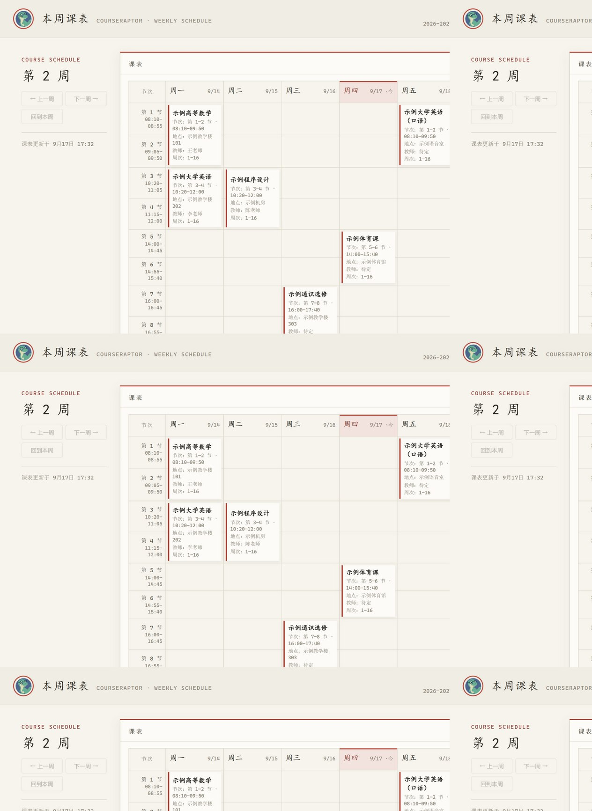

<div align="center">



# CourseRaptor

### 把教务琐事交给小恐龙，把时间留给大学生活。

**南京工业大学学生的开源教务 AI 助手 · Web / CLI / 可选 QQ**

[简体中文](README.md) · [English](README.en.md)

[](https://github.com/Health-525/courseraptor/actions/workflows/ci.yml) [](LICENSE) [](https://nodejs.org/zh-cn/download) [](https://www.typescriptlang.org/)

**[开始体验](#先体验再登录) · [能做什么](#你的问题小恐龙来接) · [使用指南](docs/student-guide.md) · [交流想法](https://github.com/Health-525/courseraptor/discussions) · [反馈问题](https://github.com/Health-525/courseraptor/issues/new/choose)**

</div>

---

> 早八在哪栋楼？通识修了哪些类别？考试改时间了吗？通知附件里有没有我需要看的内容？
>
> **不用再从一个菜单翻到另一个菜单。打开 CourseRaptor，直接问。**

CourseRaptor 把课表、成绩、考试、教务通知和日历导出放进同一个对话窗口。你负责说清楚想知道什么，小恐龙负责调用工具查数据、整理结果。

**目前适配南京工业大学，适合个人电脑自用。** 这是非官方开源项目；正式查询需要自己的教务账号和 DeepSeek API Key，模型 API 可能产生费用。先运行离线演示，无需填写任何凭证。

## 你的问题，小恐龙来接

<table>
<tr>
<td width="50%" valign="top">
<h3>课表随口问</h3>
<p><b>“这周有什么课，在哪上？”</b></p>
<p>按学期、教学周整理课程、节次和地点，结合单双周及已记录的调休安排。</p>
</td>
<td width="50%" valign="top">
<h3>学业看得清</h3>
<p><b>“哪些课还需要我留意？”</b></p>
<p>GPA、已获学分、未通过与待确认课程一起看；通识分类辅助核对修读情况。</p>
</td>
</tr>
<tr>
<td width="50%" valign="top">
<h3>考试有条理</h3>
<p><b>“最近什么时候考试？”</b></p>
<p>查询科目、日期、时间、考场与座位信息，把复习准备的第一步理清楚。</p>
</td>
<td width="50%" valign="top">
<h3>通知读重点</h3>
<p><b>“这条通知需要我做什么？”</b></p>
<p>从通知列表读到正文和附件，按你的问题提取重点，再回到原文核对。</p>
</td>
</tr>
<tr>
<td width="50%" valign="top">
<h3>手机日历见</h3>
<p><b>“把课表和考试导出到日历。”</b></p>
<p>生成 .ics 文件，网页下载后导入手机；也可选配 GitHub / Gitee 公开订阅源。</p>
</td>
<td width="50%" valign="top">
<h3>材料变成品</h3>
<p><b>“把这份材料整理成文档。”</b></p>
<p>读文档、筛表格、辅助写作，生成 Word / Excel / PPT / PDF 后直接下载。</p>
</td>
</tr>
</table>

<details>
<summary><b>还有这些：记忆、天气、QQ 接入与可选选课能力</b></summary>

- **跨会话记忆**：记录偏好与事实，减少重复说明。
- **天气查询**：查看天气、降水与穿衣建议。
- **QQ 接入**：使用腾讯官方机器人接口；共用本机教务身份，适合个人使用。
- **选课信息查询**：搜索课程、对比教学班与余量；真实选课提交默认关闭。

全部工具、适用范围与限制见[能力参考](docs/capabilities.md)。

</details>

## 先看一眼

<div align="center">



<sub>真实网页界面，虚构演示数据。</sub>

</div>

<details>
<summary><b>展开看：可以怎样和它聊？</b></summary>

下面是**示例对话**，不代表真实查询结果。

```text
你：这周课表，按天整理地点和时间。
小恐龙：周一 1–2 节，示例高等数学，示例教学楼 101……

你：我的通识修了哪些类别？
小恐龙：先按已通过课程汇总。未通过和待出分课程不计已获学分。
        类别覆盖和最低学分，还要对照你的年级与专业培养方案。

你：把课表和考试导出到手机日历。
小恐龙：正式模式会生成 .ics 文件，在网页中下载后即可导入。
```

</details>

## 先体验，再登录

### 01 / 三条命令，认识小恐龙

先安装 [Node.js 24 或更高版本](https://nodejs.org/zh-cn/download)，下载仓库并解压，在项目目录打开终端：

```bash
npm ci
npm run doctor
npm run demo
```

打开终端显示的地址，默认 **`http://127.0.0.1:3211`**。点击常用问题即可体验。

**免教务账号 · 免 API Key · 不调用 AI · 全部虚构数据。** 演示使用固定示例回答，不代表实时查询效果；会话只保留在内存，重启清空。`Ctrl+C` 退出。

<details>
<summary><b>更习惯 Git？展开复制克隆命令</b></summary>

```bash
git clone https://github.com/Health-525/courseraptor.git
cd courseraptor
npm ci
npm run demo
```

</details>

### 02 / 配置自己的账号，开始正式使用

**Windows：** 双击完整项目里的 `start.bat`，按提示配置。

**已经安装依赖，或使用 macOS / Linux：**

```bash
npm start
```

1. 输入自己的教务学号和密码，登录验证后加密保存在本机。
2. 按隐藏输入提示填写 DeepSeek API Key；需要更换时，在终端输入无参数 `/key`。
3. 在终端对话，或打开启动界面显示的网页地址，通常是 **`http://localhost:3210`**。

保持终端运行即可。一般无需编辑 `.env`；遇到问题先看[同学使用指南](docs/student-guide.md)，进阶选项看[配置参考](docs/configuration.md)。

## 下一站，由真实需求决定

现有能力继续打磨，下面这些是**规划方向，尚未实现**：

| 方向 | 想解决的事 |
|---|---|
| 今日日程 | 打开就看到下一节课、最近考试和数据更新时间 |
| 截止提醒 | 把通知中的报名、补选和材料截止日期变成可确认待办 |
| 变更提示 | 成绩更新、换教室、考试改期，一眼看到差异 |
| 培养方案核对 | 按年级与专业核对学分缺口，保留规则来源 |
| 选课冲突检查 | 对比周次、节次与备选教学班 |
| 复习计划 | 按考试日期和个人可用时间安排复习 |

[查看详细路线图 →](docs/roadmap.md)　[说说你最想要的功能 →](https://github.com/Health-525/courseraptor/issues/new?template=feature_request.yml)

## 好用，也把边界说清楚

| 你可能关心 | 实际情况 |
|---|---|
| 是学校官方产品吗？ | 不是。目前适配南京工业大学，无官方隶属或背书 |
| 本地运行就是完全离线吗？ | 不是。正式对话的提问与所需查询结果会发送至配置的模型服务 |
| 学分统计能当毕业审核吗？ | 不能。通识类别覆盖不等于满足最低学分，请核对本人培养方案 |
| 日历会公开吗？ | 本地 .ics 导出无需公开；当前 GitHub/Gitee 订阅使用公开仓库，发布前需要确认 |
| 可以多人共用我的账号吗？ | 不建议。QQ 白名单不提供多学生身份隔离 |
| 会自动抢课或一直监控吗？ | 真实选课默认关闭；当前没有通用后台主动提醒能力 |

分享仓库地址或维护者检查过的干净安装包，让每位同学配置自己的账号。**请勿转发已经使用过的整个项目目录。** 数据去向、使用边界与安全报告方式见 [SECURITY.md](SECURITY.md)。

## 给想一起做点东西的你

```text
你的问题
   ↓
Web / CLI / QQ
   ↓
Vercel AI SDK Agent + DeepSeek
   ↓
教务查询 · 通知附件 · 成绩计算 · 日历 / 文档
```

学校接口放在 `src/jwgl/`，工具参数在 `src/tools/`，成绩概览采用可独立测试的纯计算，正式网页与演示复用 `src/web/chat-page.ts`。

```bash
npm run typecheck
npm run lint
npm test
```

[贡献指南](CONTRIBUTING.md) · [完整能力](docs/capabilities.md) · [维护与分发](docs/maintainers.md) · [推广素材包](docs/promotion.md)

## 让更多同学遇见小恐龙

<table>
<tr>
<td align="center" width="33%"><h3>觉得有用</h3><p>给仓库一个 Star，方便以后找到。</p><a href="https://github.com/Health-525/courseraptor">打开仓库</a></td>
<td align="center" width="33%"><h3>有个想法</h3><p>分享具体场景，告诉我们哪里还不顺手。</p><a href="https://github.com/Health-525/courseraptor/discussions">参与讨论</a></td>
<td align="center" width="33%"><h3>想动手</h3><p>改文档、补测试，或修好一个真实问题。</p><a href="CONTRIBUTING.md">开始贡献</a></td>
</tr>
</table>

<div align="center">

**CourseRaptor · 教务琐事，一句话。**

<sub>Made for students, built in the open. · <a href="LICENSE">ISC License</a></sub>

</div>
