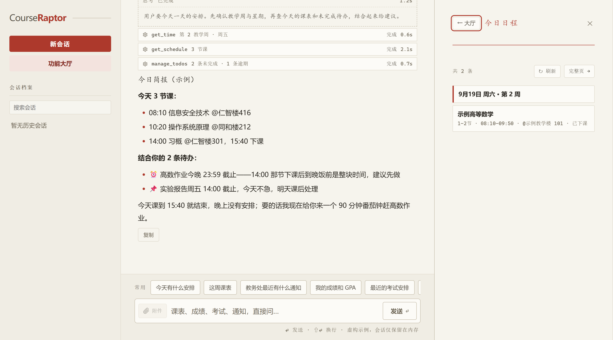
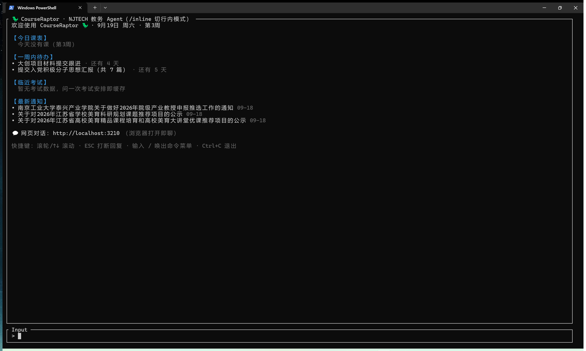

<div align="center">


# 🦖 CourseRaptor

**大学教务对话式 Agent**
课表 · 成绩 · 考试 · 学籍 · 教务通知 · 待办 · 知识库 · 记忆，一句话搞定。

[](https://github.com/Health-525/courseraptor/releases/latest)

[](#)
[](https://ai-sdk.dev)
[](https://www.deepseek.com)
[](#-技术栈)
[](https://github.com/Health-525/courseraptor/commits/master)
[](https://github.com/Health-525/courseraptor)

**[✨ 能力总览](#-能力总览) · [🚀 快速开始](#-快速开始) · [📡 已知状态](#-已知状态-2026-09) · [🏗️ 技术栈](#-技术栈) · [⚠️ 免责声明](#️-免责声明)**

</div>

---

在终端里和一只迅猛龙对话，它会替你登录教务系统、查数据、读通知、记住你的偏好：

```text
$ raptor

你   这学期课表看一下
🦖   2026-2027学年第一学期，共 8 门课。周一 7-8 节「最优化方法」@仁智楼518；
     周三全天没课；操作系统原理第 14-17 周改上机（学院机房）。

你   我通识选修六类还缺哪几类？
🦖   已修：自然类 ✅ AI前沿 ✅ 创新创业 ✅ 人文 ✅；
     还差公共艺术类和社会类（各有最低学分要求）。

你   最近教务处有什么通知？
🦖   已读 3 条最新公告，重点：四六级成绩可查、转专业名单公示……

你   记住：体育课我都想选羽毛球
🦖   已存入长期记忆，下次选课我会提醒你。

你   这周我要交高数作业，周五交实验报告
🦖   已记录 2 条待办：交高数作业（9月16日 23:59 截止）、实验报告
     （9月18日 14:00 截止）。课表页待办卡片可见，到期前一周开始每天提醒你。
```

## 📸 界面预览

同一个 agent，两种入口：终端里敲 `raptor` 直接对话，或浏览器打开 `http://localhost:3210` 用网页版。思考过程、工具调用、每轮问答都会归档进会话历史。工具产出的成品文件（课表/考试 .ics 日历、生成的 Word/Excel/PPT/PDF）在网页里直接点「下载」保存，不用去翻目录；对话里开个番茄钟，工具卡下方就是实时倒计时。

<div align="center">

**网页版 · 红头档案 UI**



**终端版 · TUI 欢迎面板**



</div>

## ✨ 能力总览

Agent 默认可调用 **30 个工具**，覆盖教务查询、通知情报、文件与数据、文档写作、时间·日历·天气、两层记忆、待办提醒、知识沉淀、番茄钟、QQ 接入十条线。

| 📚 教务查询 | 📰 通知情报 | 📁 文件与数据 | ✍️ 文档写作 | 🕐 时间·日历·天气 | 🧠 两层记忆 | 📝 待办与知识 | 🍅 番茄钟 | 💬 QQ 接入 |
|---|---|---|---|---|---|---|---|---|
| 课表/成绩/考试/学籍一句话查 | 通知正文+附件（xlsx/docx/pdf/pptx/txt）都能读 | 千行 Excel 概览+筛选按需查，长文分页读得完 | AI 辅助写作，直接产出 Word/Excel/PPT/PDF 成品 | 日期/教学周/时区，课表考试导出 .ics 或订阅到手机，天气带穿衣建议 | 记住偏好和结论，跨会话不丢 | 待办随口记、到期提醒；知识自动沉淀按课程归类 | 说一句「专注 25 分钟」，网页实时倒计时 | 官方机器人零封号，群里 @ 就能用 |

### 📚 教务查询

| 工具 | 说明 | 耗时 |
|---|---|---|
| `get_schedule` | 课表：自动探测最新学期（学期交界不查错），含节次时间段与当前周次；**带按周预分组索引**，问「第一周有什么课」直接查表不靠模型推算；也可指定如 `2026-2027-1` | ~3-5s |
| `get_grades` | 全部学期成绩 + GPA（NJTECH 绩点规则，重修取最高分）+ **通识选修六类统计** | ~10s |
| `get_exams` | 考试安排：科目 / 日期 / 考场 / 座位号 | ~3-5s |
| `get_student_info` | 学籍个人信息（学院/专业/班级/年级等档案字段，敏感字段自动打码） | ~3s |
| `get_enrolled_courses` | 已选课程教学班（课程/教师/时间/学分/必修选修） | ~3s |
| `get_retake_courses` | 可重修课程列表（历年开课记录，关键词过滤） | ~5s |
| `get_lab_grades` | 实验成绩（按学期探测） | ~3-5s |
| `check_selection_status` | 选课模块状态：是否开放、接口是否正常 | ~3s |
| `search_courses` | 按关键词搜可选课程，查余量与课程归属 | ~3-5s |
| `search_classes` | 查某门课**所有教学班**明细：各班教师 / 时间 / 地点 / 余量对比 | ~5s |
| `list_choosed_courses` | 本轮已选课程（选课模块维度） | ~3s |

### 📰 通知情报

| 工具 | 说明 | 耗时 |
|---|---|---|
| `get_news` | 教务处官网（jwc.njtech.edu.cn）最新通知列表：公告通知 / 教学动态 / 考试排课；**按你的年级自动标相关度**（high=需本人行动 / low=其他年级或行政公示），不再平铺十几条让你自己挑 | ~5s |
| `read_notice` | 读通知**正文全文**（选课时间表、截止日期都在正文里）；也支持直接读用户贴的校园网链接 | ~3s |
| `fetch_attachment` | 通知附件获取：**下载一次即缓存**（再查免下载，jwc 验证码只过一次）。表格（xlsx/xls/csv）回概览（表头+行数+前 15 行），明细用 `query_table` 筛；文档（docx/pdf/txt）全文**分页续读**，或直接 `keyword` 定位拿上下文。本地离线解析，`RAPTOR_DISABLE_CAPTCHA_OCR=1` 可停用验证码自动识别 | ~10-20s（缓存后 <1s） |

### 📁 文件与数据

| 工具 | 说明 |
|---|---|
| `read_local_file` | 读用户给出路径的本机文件：docx/pdf/txt/md 全文分页，xlsx/csv 转表格查询。只读入缓存**副本**，绝不改动用户文件 |
| `query_table` | Excel 筛选查询：`keyword` 全列检索、`where` 多条件（contains/eq/数值比较/正则/空值）、`sortBy` 排序、`columns` 选列、`values` 某列去重计数、`offset/limit` 分页——千行大表按问题取行，不再整本塞给模型 |
| `run_js` | 沙箱 JS 计算台：去重/计数/分组求和/正则摘取。无网络无磁盘，3 秒超时、输出截断 |
| `manage_attachments` | 附件缓存管理：list / delete / delete_all。只认缓存索引，agent 只能删自己下载/读入的副本，用户本机文件永远删不到 |

### ✍️ 文档写作（AI 辅助学生产出交付物）

| 工具 | 说明 | 耗时 |
|---|---|---|
| `generate_document` | 按结构化内容直接生成 **Word / Excel / PPT / PDF** 成品文件，中文原生可写（PDF 自动嵌入系统中文字体）。要「实践报告 / 开题课件 / 成绩表 / 简历模板」等交付物时用：docx·pdf 给 `blocks`（标题/正文/列表/表格/分页）、pptx 给 `slides`、xlsx 给 `sheets`。成品写进本机 `data/generated/`，返回完整路径；QQ 里会自动把文件回传给你 | ~1-3s |
| `convert_document` | 跨格式转换重排：把已有内容（`fetch_attachment` 读入的附件 id、或本机文件路径、或一段文本）转成 Word/Excel/PPT/PDF，如「PDF 转 PPT」「表格转 Word」「把这段整理成排版好的文档」。源文件**只读不动**，成品写 `data/generated/` | ~1-3s |

> 改写润色（换词、调结构）由模型在文本层完成，改好后交给 `generate_document` 出稿；`convert_document` 专注跨格式搬运与排版。

### 🕐 时间 · 日历 · 天气

| 工具 | 说明 | 耗时 |
|---|---|---|
| `get_time` | 当前日期 / 星期 / 时刻 / 时区换算，外加**本学期教学周**（第几周、本周一~周日日期、距开学倒计时）。agent 没有内置时钟，回答任何时间问题前都要先调它拿真实时间——「今天几号 / 现在第几周 / 下周三几号 / 离截止还有几天 / 通知是否过期」一律先查再答 | <1s |
| `set_holidays` | 把教务处发布的**放假 / 调休安排**逐日落盘到 `data/term-holidays.json`（放假日标 `holiday`、调休补课日记「按周几上课」），之后 `get_schedule` 与日历导出会自动叠加假期与补课 | ~1s |
| `export_calendar` | 把整学期课表 / 考试导出 **.ics 日历文件**（逐周展开，自动跳过放假日并生成「放假」全天事件、调休补课按被换周几补出、考试带提前 30 分钟提醒），存 `data/generated/` 回绝对路径，手机日历 App 点开导入即可 | ~3-5s |
| `publish_calendar` | 把课表 / 考试日历发布到 **Gitee（国内直连）或 GitHub** 公开仓库，返回手机可「**订阅**」的链接——课表变化重新发布即自动刷新，不用反复导文件（需配 `GITEE_TOKEN`/`GITHUB_TOKEN`）。首次发布是公开外网操作，agent 会先与你确认 | ~5-10s |
| `get_weather` | 实况 + 未来 1-14 天预报（默认 7 天）：天气码已译成中文，自带**带伞与穿衣建议**（按降水概率和昼夜温差算）。默认查学校所在城市（NJTECH → 南京），说「老家天气」「海口呢」就自动换城市；数据源 Open-Meteo，**免密钥、不用配 .env**。首次查某地名会多一次解析请求（并已实测：「海口」会自动纠正到海南省会而非云南同名镇），之后走本地缓存 | ~1-2s |

### 🧠 两层记忆

| 层 | 存储 | 机制 |
|---|---|---|
| **短期记忆** | `session.json`（本地） | 模型中间件逐轮捕获完整对话并落盘；下次启动注入上次会话**尾部**若干轮（避免已聊完的事挤占上下文），跨重启延续 |
| **长期记忆** | `memory.json`（本地） | agent 通过 `save_memory` 工具自主维护事实条目（偏好/结论/时间安排）；近似重复自动合并、可设过期时间、办完的事 `archive` 归档，只有生效中的条目会注入 |

说一次「记住××」，之后每次新会话它都记得。记忆文件在本地且已被 `.gitignore` 排除。

### 📝 待办与提醒

随口说的安排直接变成待办，落在本地 `data/web-workspace.json`，对话、课表页、网页功能大厅三个入口共用同一份数据：

| 入口 | 说明 |
|---|---|
| `manage_todos` 工具 | 对话里说出待办即批量记录（一次说几件记几件；「明天 / 下周五」这类相对日期先 `get_time` 换算，没给截止时间会先问一句）；问「我有哪些待办」用 list，完成 / 删除用 update / delete |
| 功能大厅待办面板 | 逾期置顶、按今天 / 明天分组，可直接手动添加、勾选完成、删除；与课表页 `/today` 待办卡片同步 |
| 课表页待办卡片 | `/today` 本周课表下方常驻：未完成按截止排序、逾期朱砂红 ⚠、勾选完成、确认删除 |
| 到期自动提醒 | 待办进入「距到期 ≤ 7 天」窗口后**每天提醒一次**：Windows 桌面通知 + QQ 推送到白名单账号（桥在线时）；早 8 点前不弹、单轮至多 5 条、启动即补查，完成或删除即停。`RAPTOR_NO_TODO_REMINDERS=1` 关闭 |

```text
你   我这周要交高数作业，周五还有个实验报告
🦖   已记录 2 条待办：交高数作业（9月16日 23:59 截止）、
     实验报告（9月18日 14:00 截止），课表页和功能大厅里都能看到。
```

提醒依赖应用（或 `npm run qq` 的桥）在运行中；终端欢迎面板另有「一周内待办」速览段（含逾期标记）。

### 📚 知识库

对话里说出的知识点会自动沉淀：agent 判断消息里的概念、公式、方法、结论值不值得记，值得就写进本地 `data/knowledge.json`，并**优先按课表里真实存在的课程归类**——对得上就归入该课程（「高数」这类俗称也能对上）；给的 subject 对不上课程时以 subject 为**自定义分类**（如「编程技术」「TypeScript」）；完全看不出归属才落「未分类」：

| 入口 | 说明 |
|---|---|
| `manage_knowledge` 工具 | 对话里分享知识即记录（一次说几条记几条，同名知识自动更新不堆积）；问「我记过哪些知识」用 list（可按分类/关键词筛），改内容或归属用 update，删用 delete。闲聊、提问、待办不会误入库，拿不准时 agent 会先问一句 |
| 课表页知识卡片 | `/today` 待办卡下方常驻：最近 5 条速览（标题 + 分类徽章 + 日期 + 内容两行摘录）、总数统计、「查看全部」链到独立页 |
| 独立知识库页 | `/knowledge`：全部条目按分类导航（带计数）、关键词搜索、确认删除；聊天页侧栏「知识库」直达 |
| 大厅知识库面板 | 功能大厅里按课程归类、可搜可展开全文，条目支持直接删除 |

```text
你   记住：洛必达法则是求 0/0 型极限的，分子分母分别求导再取极限
🦖   已记录 1 条知识（高等数学 ×1）。课表页和 /knowledge 页都能看到。
```

与待办一样，QQ 渠道说出知识点同样会记录（走同一个 agent 工具）。

### 💬 QQ 接入（官方机器人）

除终端外，agent 还能挂到 QQ 上（腾讯官方开放平台路线，零封号风险）：

```bash
# 1. 在 https://q.qq.com 用主号实名注册 -> 创建机器人 -> 拿到 AppID / AppSecret
#    （机器人能力勾选「群聊（@消息）」，单聊需用户先添加机器人为好友）
# 2. 凭证二选一填法：
#    a. 网页「功能大厅 → 设置」（推荐）：AppID / AppSecret / 激活暗号三项填好保存，
#       AES-256-GCM 加密存本机，桥自动上线，不用碰任何文件
#    b. .env 填入 QQBOT_APP_ID / QQBOT_APP_SECRET / QQBOT_PASSCODE（自定激活暗号）
# 3. 启动：一条 raptor 全包（终端对话 + QQ 机器人同时在线，前台运行，Ctrl+C 退出）
raptor
#    只跑 QQ 桥（不开终端对话）：
npm run qq
# 4. QQ 里给机器人发第一条消息 = 激活暗号，完成授权
```

- **单聊**：直接和机器人对话；**群聊**：@机器人 触发
- **安全**：白名单制，未授权用户一律拒绝；授权 openid 落盘 `qq-allowlist.json`（gitignored）
- 官方平台给的是 openid 而非 QQ 号，所以用暗号激活代替加白名单
- 每用户独立上下文（内存滑动窗口 20 条，只用于喂模型）；回复自动 Markdown 转纯文本 + 长消息分段
- **QQ 对话同时进网页历史记录**：每轮问答另外归档到 `data/chat-sessions.json`，私聊每人一档、群聊每群一档，
  标题带「QQ｜」/「QQ群｜」前缀，网页侧栏点开即可回看（答砸的那轮只留提问）。这条线**只写不读**——
  在网页里删除或改名这些档案，不影响 QQ 那边正在进行的对话
- **待办到期提醒主动推送**：距到期 7 天内每天一次，桌面通知之外同步推送到白名单 QQ（受官方平台主动消息频率限制，尽力送达）
- 限制：官方机器人以被动回复为主（约 5 分钟窗口）

### 🖥️ 网页版 · 功能大厅

网页侧栏收敛为一个「**功能大厅**」：点开后是宫格主页，点任意面板，内容从右侧整列推出、把对话区往左推（真 push 布局，不是盖在上面的弹层）。九个面板按三组摆放：

| 学习安排 | 效率工具 | 系统 |
|---|---|---|
| 📅 今日日程 · 🗓️ 课表 · 📝 考试 · 📊 成绩 · 📣 教务通知 | ✅ 待办 · 📚 知识库 · 🍅 番茄钟 | ⚙️ 设置 |

- **对话自动联动**：agent 在对话里调到对应工具（查成绩、记待办、开番茄钟……）时，对应面板会自动推出来展示结果；面板也能从侧栏红点角标（如「3 条待办 / 今日 2 节课」）一眼看出有没有新东西
- **今日简报**：说「今天有什么安排」，agent 不再分两张清单各念各的——课表时间线、今天到期的待办会交叉着给结论（「最优化方法 17:40 下课，正好回去赶 23:59 截止的实验报告」），还可以建议空档放个番茄钟
- **待办面板**：逾期置顶、按今天/明天分组，可以直接手动添加、勾选完成、删除；与课表页 `/today` 的待办卡片共用同一份数据
- **成绩 / 教务通知面板**：GPA、学分与最近学期成绩速览；教务处最新通知照旧标出需要你行动的那几条
- **番茄钟**：对话里说「开始 25 分钟番茄钟」即可；对话时间线出现倒计时卡片（时间到翻朱砂底 + 桌面通知 + 标题提醒），大厅面板看进行中的计时与最近记录
- **知识库面板**：按课程归类、关键词搜索、展开全文，条目可直接删除
- **设置面板**：顶部四栏「状态总览」一眼看清教务账号 / 模型 / QQ / 本地数据配没配，点 chip 直达对应栏目；危险操作走两步确认。agent 也能应你一句「打开设置」自己调 `open_settings` 推出面板
- **小细节**：面板内搜索、操作乐观更新（点了立即变、失败回滚）、`#panel` hash 深链直达；窄屏自动退回滑入抽屉 + 遮罩

### ⌨️ 终端交互

- **斜杠命令菜单**：输入框敲 `/` 即弹出候选命令（`/card` `/inline` `/key` `/update` `/exit`），↑/↓ 或滚轮选择、Tab 或回车补全，继续输入按前缀过滤；ESC 收起（收起后本行不再自动弹出，删空重来即可）
- **双 UI 运行时互切**：默认全屏卡片模式，`/inline` 切行内模式（输出进终端缓冲区，滚轮/选中复制可用），`/card` 切回
- 滚轮/↑↓ 滚动 · ESC 打断正在进行的回复（菜单弹出时 ESC 只收菜单）· Ctrl+C 退出

## 🚀 快速开始

### 方式一：下载安装包（推荐给同学）

任何人均可下载安装包并自行配置所需凭证：

1. 到 [Releases](https://github.com/Health-525/courseraptor/releases/latest) 下载文件名带 **`portable-win-x64`** 的那个 zip（约 112MB，已内置 Node 运行时，**不用装 Node.js、也不用联网装依赖**）。别下页面最底部 GitHub 自动生成的 Source code 包，那只是源码快照。
2. 右键 zip →「全部解压缩」，双击解压出来文件夹里的 **`start.bat`**（首次会引导录入教务账号和 DeepSeek API Key，加密存在本机，之后免填；教务账号也可直接回车跳过，之后在网页「功能大厅 → 设置 → 教务账号」里补填）。

> 双击没反应或被拦截：包里的 `runtime\node.exe` 是 Node 官方运行时、未做代码签名，SmartScreen 弹窗选「更多信息 → 仍要运行」，或把解压出的 `CourseRaptor` 文件夹加入杀软信任区。

### 方式二：git 克隆（开发者）

```bash
# 1. 克隆 & 安装
git clone https://github.com/Health-525/courseraptor.git
cd courseraptor && npm install

# 2. 配置凭证
#    DeepSeek Key：cp .env.example .env 后编辑填入
#    教务账号：留空即可，首次启动 raptor 引导录入并加密保存本机；引导时回车可跳过，跳过后在网页「功能大厅 → 设置 → 教务账号」里补填

# 3. 注册全局命令（一次即可，任意目录可用）
npm link

# 4. 启动
raptor                 # 全局命令
npm run dev            # 或项目内开发模式
```

### 🔄 更新（给同学）

raptor **每 24 小时检查一次新版本**。有新版时标题栏会出现 `🔄 新版 vX.Y.Z，/update 可更新` 徽标，对话里直接输入：

```text
/update
```

即一键完成：下载新版 → 覆盖安装（你的凭证 / 记忆 / 会话 / QQ 授权名单不受影响）→ 自动装依赖，然后重启 raptor 即可。嫌下载进度看不清可以先 `/inline` 切行内模式再执行。

不想要提醒：`.env` 里加 `RAPTOR_NO_UPDATE_CHECK=1`。

### 🛠️ 部署更新后台 + 发版（给维护者）

分发链路由 **更新后台**（同学端查版本/下载包）、**发版命令**（打 zip 并发布）、**客户端自更新**（`/update`）组成。后台不需要数据库或额外 npm 依赖；任何能跑 Node 的机器（云服务器/宿舍旧电脑）都能部署：

```bash
# 0. 先把 server/nginx.conf.example 复制到服务器并替换 updates.example.com；
#    用 Nginx + Let's Encrypt 对外提供 HTTPS。Node 服务默认只监听 127.0.0.1。

# 1. 部署后台（建议 pm2 常驻；管理员密钥必须是高强度随机值）
UPDATE_ADMIN_TOKEN=你的管理员密钥 HOST=127.0.0.1 PORT=8787 pm2 start server/update-server.mjs --name raptor-update

# 2. 本机 .env 配置 HTTPS 后台地址与发布密钥
#    UPDATE_SERVER_URL=https://updates.你的域名.com
#    UPDATE_ADMIN_TOKEN=你的管理员密钥

# 3. 改完代码、提交后，一条命令发版（打包时会把 HTTPS 地址写入同学安装包）
npm run publish -- "本次更新说明"            # patch：0.1.0 -> 0.1.1（默认）
npm run publish -- minor "更新说明"          # 0.1.0 -> 0.2.0
npm run publish -- major "更新说明"          # 0.1.0 -> 1.0.0
```

发布成功后，同学端 raptor 下次启动即提示，`/update` 一键升级。打包自动排除 `.env` / `credentials.enc` / 会话记忆等本机隐私文件，`eng.traineddata`（验证码 OCR）随包分发。

其他配置：

- 客户端后台地址由 `npm run publish` 在打包时写入安装包；仅维护者本地可用 `.env` 的 `RAPTOR_UPDATE_SERVER` 覆盖
- 未配置后台时仍可正常使用；正式 zip 没有 HTTPS 更新地址将无法使用自动更新
- 后台数据在 `update-data/`（版本 zip 与 meta），部署时记得备份、别删

<details>
<summary><b>⚙️ 环境变量</b></summary>

| 变量 | 说明 |
|---|---|
| `DEEPSEEK_API_KEY` | DeepSeek API Key（或启动后对话里输入 `/key sk-你的Key` 配置，加密保存、立即生效） |
| `JWGL_USERNAME` / `JWGL_PASSWORD` | 教务系统学号 / 密码（可选；留空则首次启动引导录入并 AES-256-GCM 加密保存，引导可回车跳过、不配也能用，跳过后在网页「功能大厅 → 设置 → 教务账号」里补填） |
| `RAPTOR_MODEL` | 模型，默认 `deepseek-flash`（官方当前主力型号 V4.1-Flash，原生支持图片输入），可选 `deepseek-v4-pro` 等；官方已停用 `deepseek-chat` / `deepseek-reasoner` 别名并退役 `deepseek-v4-flash` 系列，本地存有旧型号时启动自动迁移；网页「功能大厅 → 设置」里选过的型号加密保存并优先于此项 |
| `RAPTOR_TUI_INLINE` | 设 `1` 让终端默认走行内渲染（输出顺命令行下滚、滚轮/选中复制可用），等价对话里的 `/inline` |
| `RAPTOR_WEB_PORT` | 网页版端口，默认 `3210`（被占用时自动选空闲端口，以终端提示为准） |
| `FIRECRAWL_API_KEY` | Firecrawl 云解析通知附件（可选；本地已支持 xlsx/docx/pdf/pptx/txt，仅作兜底） |
| `GITHUB_TOKEN` / `GITEE_TOKEN` | 日历订阅发布令牌（可选）：配后 `publish_calendar` 可把课表/考试发到名下公开仓库、手机用订阅链接自动同步。国内手机优先 `GITEE_TOKEN`（直连更稳），GitHub 令牌需 `repo` 权限 |
| `QQBOT_APP_ID` / `QQBOT_APP_SECRET` | QQ 官方机器人凭证（可选；也可在网页「功能大厅 → 设置」里填写，AES 加密保存且保存后桥自动上线。两边都配时 `.env` 优先） |
| `QQBOT_PASSCODE` | QQ 授权暗号：首次给机器人发此暗号完成授权（同样可在网页「功能大厅 → 设置」里设置） |
| `RAPTOR_DISABLE_CAPTCHA_OCR` | 设 `1` 停用附件下载里的图形验证码自动识别（默认启用、重试上限 3 次） |
| `RAPTOR_MAX_RPS` | 教务请求全局限速上限：只允许下调、请勿调高，尊重教务系统承载 |
| `RAPTOR_NO_TODO_REMINDERS` | 设 `1` 关闭待办到期自动提醒（默认开启：距到期 ≤ 7 天每天一次，Windows 桌面通知 + QQ 推送） |
| `RAPTOR_NO_UPDATE_CHECK` | 设 `1` 关闭启动时的版本更新检查（默认开启） |
| `RAPTOR_UPDATE_SERVER` | 仅维护者本地测试时覆盖更新后台地址；必须为 HTTPS，正式安装包由发版命令内置地址 |
| `UPDATE_SERVER_URL` / `UPDATE_ADMIN_TOKEN` | 维护者配置：更新后台地址与发布管理员密钥 |
| `DEEPSEEK_BASE_URL` | 自定义 API 地址（可选） |

</details>

## 📡 已知状态（2026-09）

- 学期交界期课表/考试查询为**候选学期探测**，不依赖日历日期推断；开学日期按校历维护（未知学期按 9 月/3 月第一个周一估算并标注）。
- 课表查询自动叠加**放假/调休覆盖**：假期日整周标注「放假」、调休补课日按被换周几的课表补出行；具体安排由 agent 读教务处通知后经 `set_holidays` 落盘到 `data/term-holidays.json`。
- 教务线路偶发抖动：所有登录内置 5 次指数退避重试，单学期成绩查询带重试。

<details>
<summary><b>教务系统模块覆盖清单（55 个菜单模块）</b></summary>

- **已接入 30 个工具**：课表 / 成绩 GPA / 考试 / 学籍 / 已选教学班 / 可重修 / 实验成绩 / 选课查询四件套 / 教务处通知三件套 / 文件与数据四件套（本地文件读取、Excel 筛选、沙箱计算、附件缓存管理）/ 文档写作两件套（Word·Excel·PPT·PDF 生成与跨格式转换）/ 放假调休落盘 / 时间（日期/教学周/时区，模型回答任何时间问题前的必查项）/ 整学期 .ics 日历导出与发布（课表+考试，含调休与假期处理；发布到 Gitee（国内直连）或 GitHub 后手机日历订阅链接自动更新）/ 天气 / 记忆 / 待办（对话记录 + 课表页展示 + 到期提前一周自动提醒）/ 知识库（对话自动判断记录 + 按课表课程归类 + /knowledge 页检索）/ 番茄钟（对话开计时，网页实时倒计时）/ 打开设置面板（agent 应你要求自己推出「设置」）
- **学校侧停用**（返回「系统维护页面」，任何客户端不可用）：空闲教室、班级课表、学业情况、实验课表、培养方案、站内通知
- **申请/流程类**（提交表单操作，非查询，暂未接入）：学籍异动、转专业、重修报名、毕业学位申请、毕设流程等 30+ 项

</details>

## 🏗️ 技术栈

- **Agent**：[Vercel AI SDK v7](https://ai-sdk.dev)（`ToolLoopAgent` + `runAgentTUI` 终端对话 UI；`scripts/patch-tui.mjs` 给库的空屏打欢迎面板补丁，启动后自动展示今日课表/临近考试/最新通知，`npm install` 时经 postinstall 自动生效）
- **LLM**：DeepSeek（默认 `deepseek-flash`，即 V4.1-Flash，可切换）
- **教务协议**：NJTECH 正方新版适配层（账号密码自动登录 RSA + CSRF；选课接口按官方前端 zzxkyzb.js 逆向）

## 📁 项目结构

```
├── bin/raptor.cjs      # 全局命令入口（npm link 后任意目录敲 raptor）
├── docs/               # 吉祥物 & 素材
└── src/
    ├── index.ts        #   入口：终端对话 UI（QQ 已配置时一并拉起）
    ├── agent.ts        #   agent 定义（系统提示词 + 工具装配）
    ├── config.ts       #   .env 配置加载（按项目根解析，任意目录启动均可）
    ├── pomodoro.ts     #   番茄钟引擎（计时落盘 + 进行中/最近记录查询）
    ├── attachments.ts  #   附件/本地文件流水线（缓存 + 表格概览 + 长文分页/关键词定位 + 验证码 OCR + Firecrawl 兜底）
    ├── attachment-store.ts # 附件缓存库（data/attachments 落盘索引，免重下；删除锁死缓存目录）
    ├── spreadsheet.ts  #   表格引擎（xlsx/xls/csv 结构化：筛选/排序/去重统计/分页）
    ├── sandbox-js.ts   #   run_js 沙箱（node:vm 裸上下文，限时限量，无网络磁盘）
    ├── weather.ts      #   天气（Open-Meteo 免密钥：地名两轮解析 + WMO 码中文化 + 带伞穿衣建议）
    ├── todo-reminders.ts # 待办到期提醒（每小时扫描 7 天窗口：去重落盘 + 桌面 toast + QQ 主动推送）
    ├── knowledge.ts    #   知识库（对话沉淀的知识条目：课表课程归类 + subject 自定义分类 + 本地存储）
    ├── memory/         #   两层记忆（长期事实条目 + 短期会话捕获恢复）
    ├── qq/             #   QQ 官方机器人桥（bridge + 消息格式化 + 主动推送 + 文件日志）
    ├── jwgl/           #   教务协议层（登录 / 课表 / 成绩 / 选课 / 通知爬取）
    │   ├── auth.ts     #     登录（RSA + CSRF）
    │   ├── http.ts     #     带 Cookie 管理的 HTTP 客户端
    │   ├── crypto.ts   #     正方 RSA 密码加密
    │   ├── academics.ts#     课表 / 考试（学期探测 + 周次计算 + 节次时间）
    │   ├── grades.ts   #     成绩 + GPA + 通识六类统计
    │   ├── portal.ts   #     学籍 / 已选课 / 重修 / 实验成绩
    │   ├── news.ts     #     教务处官网通知（列表 / 正文 / 附件提取）
    │   ├── xk.ts       #     选课协议（加密串 / 多轮次 / 教学班查询）
    │   └── types.ts
    ├── web/            #   网页版：聊天页 + 功能大厅 + /today 日程页 + /knowledge 知识库页 + 今日简报数据组装
    └── tools/          #   agent 工具（默认 30 个）+ 会话缓存管理
```

## ⚠️ 免责声明与使用建议

- 本项目可在 [ISC 许可证](LICENSE) 条款下自由使用、复制、修改和分发；许可证授予的权利以 `LICENSE` 为准。本项目与南京工业大学官方无关，也未获其授权或认可。
- 使用者需**自行承担全部风险**：请遵守学校相关规定及教务系统使用条款，因使用本工具产生的任何后果（包括但不限于账号受限、成绩处理）由使用者本人负责。
- 请避免大规模或高频请求，尊重教务系统的承载能力（传输层内置全局限速令牌桶，`RAPTOR_MAX_RPS` 只允许下调、请勿调高）。
- **关于验证码识别**：附件下载路径中的图形验证码由本地 tesseract 自动识别，这在技术上属于绕过网站的反自动化措施。此能力仅限用于获取**本人有权访问的通知附件**，重试上限 3 次；如需完全停用，设 `RAPTOR_DISABLE_CAPTCHA_OCR=1`。它不是本项目的能力卖点，本条声明对其单独生效。

## 🔐 安全提示

- `.env` 含教务密码与 API Key，已被 `.gitignore` 排除，**切勿提交或分享**（.env 明文保存教务密码，仅建议在个人设备使用；如需更高安全性可将密码留空、运行时交互输入）。
- 网页服务除只监听 127.0.0.1 外还有多层请求防线：Host/Origin 校验（挡 DNS rebinding 与跨站页面）、写请求必须携带页面签发的 CSRF token、请求体只认 application/json——恶意网页无法借你的浏览器覆写凭证、清空数据或冒用对话。
- 记忆/会话/授权文件（`memory.json` / `session.json` / `qq-allowlist.json`）均为本地数据，不入库。`session.json` 落盘完整对话（含学号、学籍、成绩），**请勿分享该文件**；`data/chat-sessions.json` 同时存着网页与 QQ 两个渠道的完整对话，同样是本地敏感数据，**请勿分享该文件**。QQ 桥为单用户设计，白名单只是准入控制，**不要把凭证共享给他人使用**。
- 学籍信息中的证件号/银行卡号/考生号在返回时自动打码，避免完整 PII 进入模型上下文。
- 附件云解析（Firecrawl）仅用于公开网站内容；需要登录态的教务数据一律本地直连，不经第三方。

---

<div align="center">

**🦖 CourseRaptor** · 让迅猛龙替你守教务

[⬆ 回到顶部](#-courseraptor)

</div>
