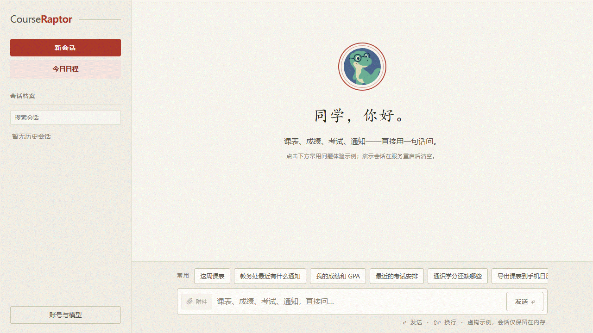

# 我给大学教务系统做了一个 AI Agent

查课表、查成绩、找考试安排、翻教务通知、把课表导进手机日历——这些事每一件都不难，但它们分散在不同页面、不同文件和不同时间点。

我最开始只是想少点几次教务系统菜单。后来它慢慢变成了一个能对话的工具：问一句“明天有什么课”“最近有什么和我有关的通知”“帮我导出到手机日历”，它会调用相应能力，把结果组织回来。

这就是我开源的 [CourseRaptor](https://github.com/Health-525/courseraptor)。



## 它目前能做什么

- 查询课表、成绩/GPA、考试、学籍和选课状态。
- 阅读教务通知与附件，筛选 Excel/CSV，整理文档内容。
- 生成课表或考试 `.ics`，再导入手机日历。
- 生成 Word、Excel、PPT、PDF 等学生常用交付物。
- 通过短期会话和长期记忆记住偏好；可从 Web、CLI 或可选 QQ 入口使用。

完整功能和边界在仓库的 [功能参考](features.md) 中。演示里的数据全部是虚构的，没有使用任何学生账号、成绩或通知。

## 我发现了一个更大的问题

现在 CourseRaptor 的教务集成只支持南京工业大学（NJTECH）。但“课表、成绩、考试、通知散落在校园系统里”的问题，几乎每所学校都有。

因此下一步不是马上宣称“支持全校”，而是把现有学校实现提炼为 **Campus Agent + University Adapter**：通用层负责对话、记忆、日历、文件和界面；学校层只处理认证与各自的课表、成绩、考试、通知数据。

```text
CourseRaptor Agent
       │
University Adapter
  ┌────┴─────┐
NJTECH     Your university
  ✅             🧩
```

我把目标接口、测试原则和隐私边界写在了 [Bring CourseRaptor to Your University](writing-an-adapter.md) 里。第一版只关注 3～5 个只读能力，不做替用户提交选课或其他教务申请。

## 如果你也想接入自己的学校

欢迎提一个 [University Adapter Issue](https://github.com/Health-525/courseraptor/issues/new?template=university_adapter.yml)，说说你的学校、系统类型（如果已知）和最想先解决的学生场景。

请不要提供账号、密码、Cookie、成绩单或只在登录后可访问的材料。我们会先用公开资料和脱敏 fixture 建立可测试边界，再讨论具体实现。

我很好奇这条 Adapter 路线能不能让 CourseRaptor 从“某个学校的工具”，逐渐变成一个别人也愿意参与的开源校园 Agent。
